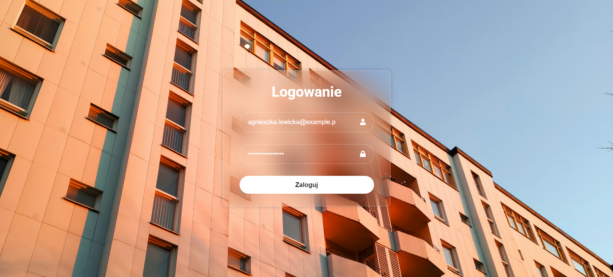

# Information system for housing association - Master Thesis
Web application in the PERN technology stack.

Project topic: <b>Information system for housing association</b>

# Author
- Wiktor Markowicz

# About project
The project was created as a project part of my master's thesis. 
This app allows you to add, read, edit or delete advertisements. You can get acquainted with scheduled events at the housing association, read invoices with rent and fees and add reports of defects.
Only administrator and worker can create accounts for other users.

# Used to create: 
- PostgreSQL
- ExpressJS
- React.js
- Node.js
- HTML
- CSS

##### Appearance of the application
### Login Page


### Main Page, after successful login


### User's advertisement page


### Calendar page


### Invoice page


### Invoice appearance


### How to start web application
##### Server (folder named: <b>backend</b>)
Commands in terminal:
```
git clone https://github.com/wiktor34306/master-s_thesis.git
cd application
cd backend
npm install
npm start
```
##### Client-side application - Frontend (folder named: <b>frontend</b>)
(different terminal)
```
cd application
cd frontend
cd application-housing-association
npm install
npm start


The page with application run automatically or if you want to run it manually,
go to localhost:3000 in your browser.
